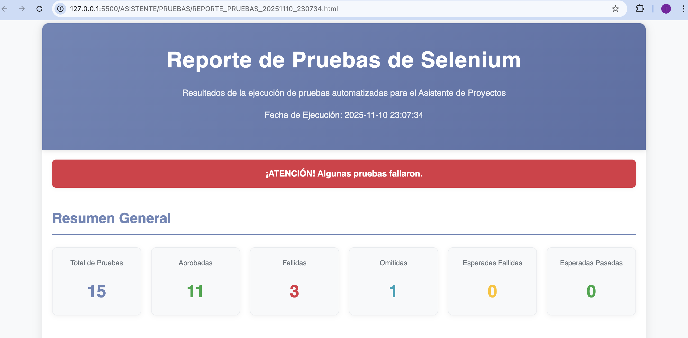

# Asistente Virtual de Proyectos

Sistema completo de gestión de proyectos con integración de Inteligencia Artificial (OpenAI ChatGPT).

## Estructura del Proyecto

```
ASISTENTE/
├── frontend/              
│   ├── index.html
│   ├── app.js
│   ├── styles.css
│   └── README.md
│
├── backend/              
│   ├── src/main/
│   │   ├── java/        
│   │   └── resources/
│   │       ├── application.properties
│   │       └── static/   
│   └── README.md
│
├── ESTRUCTURA.md        
├── sync-frontend.sh     
└── README.md             

## 🎯 Componentes

### Frontend (`/frontend/`)
- **Propósito**: Código fuente del frontend para desarrollo
- **Tecnologías**: HTML5, CSS3, JavaScript (ES6+)
- **Características**:
  - Autenticación JWT
  - Chat con ChatGPT
  - Gestión de proyectos y tareas
  - CAPTCHA "No soy un robot"

### Backend (`/backend/`)
- **Propósito**: API REST y servidor de archivos estáticos
- **Tecnologías**: Spring Boot 3.1.5, PostgreSQL, JWT
- **Características**:
  - API REST completa
  - Autenticación JWT
  - Integración con OpenAI API
  - Base de datos PostgreSQL
  - Servicio de archivos estáticos

## 🚀 Inicio Rápido

### 1. Configurar Variables de Entorno

```bash
export OPENAI_API_KEY=tu-api-key-aqui
export JWT_SECRET=tu-clave-secreta  # Opcional
```

### 2. Configurar Base de Datos

```sql
CREATE DATABASE asistente_db;
```

### 3. Sincronizar Frontend (si editaste en `/frontend/`)

```bash
cd ASISTENTE
./sync-frontend.sh
```

### 4. Iniciar Backend

```bash
cd ASISTENTE/backend
mvn spring-boot:run
```

### 5. Acceder a la Aplicación

Abre tu navegador en: `http://localhost:8080`


##  Flujo de Desarrollo

### Opción 1: Desarrollo en `/frontend/` (Recomendado)
1. Edita archivos en `/ASISTENTE/frontend/`
2. Ejecuta `./sync-frontend.sh` para copiar cambios
3. Reinicia el backend

### Opción 2: Desarrollo directo
1. Edita directamente en `/ASISTENTE/backend/src/main/resources/static/`
2. Reinicia el backend

## Tecnologías Utilizadas

### Frontend
- HTML5
- CSS3
- JavaScript (ES6+)
- Fetch API

### Backend
- Java 17
- Spring Boot 3.1.5
- Spring Security (JWT)
- Spring Data JPA
- PostgreSQL
- Maven

##  Endpoints API

### Autenticación
- `POST /api/auth/register` - Registrar usuario
- `POST /api/auth/login` - Iniciar sesión
- `GET /api/auth/check-email/{correo}` - Verificar correo

### Webhook
- `POST /webhook/chat` - Enviar mensaje a ChatGPT
- `GET /webhook/health` - Estado del servicio

### Menú
- `GET /api/menu/opciones` - Obtener opciones del menú
- `POST /api/menu/procesar` - Procesar opción

## Seguridad

- Autenticación JWT
- Contraseñas encriptadas con BCrypt
- CAPTCHA en el login
- CORS configurado

## Pruebas Automatizadas

El proyecto incluye un conjunto completo de pruebas automatizadas utilizando Selenium WebDriver y pytest para garantizar la calidad y funcionalidad del sistema.

###  Reporte de Pruebas



El sistema genera reportes visuales detallados que muestran el estado de todas las pruebas ejecutadas, incluyendo:

- **Total de pruebas**: Número total de casos de prueba
- **Aprobadas**: Pruebas que pasaron exitosamente ✅
- **Fallidas**: Pruebas que encontraron errores ❌
- **Omitidas**: Pruebas que no se ejecutaron ⏭️

###  Áreas de Prueba

Las pruebas automatizadas cubren las siguientes funcionalidades principales:

1. **Autenticación y Login**
   - Carga correcta de la página de login
   - Validación del CAPTCHA
   - Proceso de inicio de sesión
   - Manejo de credenciales incorrectas

2. **Registro de Usuarios**
   - Creación de nuevas cuentas
   - Validación de campos requeridos
   - Prevención de emails duplicados
   - Validación de formatos

3. **Interacción con el Chatbot**
   - Funcionalidad del chat
   - Integración con el menú principal
   - Gestión de proyectos y tareas

###  Ejecutar las Pruebas

Para ejecutar todas las pruebas y generar el reporte:

```bash
cd ASISTENTE/PRUEBAS
python3 ejecutar_todas_las_pruebas.py
```

El reporte HTML se generará automáticamente con un nombre único basado en la fecha y hora de ejecución.

###  Requisitos

Las pruebas requieren:
- Python 3.7+
- Selenium WebDriver
- Chrome/Chromium instalado
- Backend ejecutándose en `http://localhost:8080`

Instalar dependencias:

```bash
cd ASISTENTE/PRUEBAS
pip3 install -r requirements.txt
```

### Importancia de las Pruebas

Las pruebas automatizadas son fundamentales para:

- **Garantizar calidad**: Verificar que todas las funcionalidades trabajan correctamente
- **Prevenir regresiones**: Detectar errores antes de que lleguen a producción
- **Documentación viva**: Las pruebas sirven como documentación del comportamiento esperado
- **Confianza en despliegues**: Validar que los cambios no rompen funcionalidades existentes